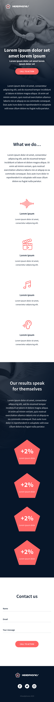

Implement a design from scratch Project - README  
Project Title: Implement a design from scratch Headphone company  

Project Overview

This project demonstrates HTML and advanced CSS techniques for creating sophisticated and interactive web page designs.

It has different pages

Who We Are:

Headphone Company Name is a company driven by a team of dedicated audiophiles and engineers. We combine cutting-edge technology with meticulous design to deliver headphones that not only sound incredible but also feel luxurious and comfortable.

What We Do:

We offer a range of headphones to cater to diverse preferences and needs:

Our Results: What Sets Us Apart

Award-Winning Sound: Our headphones have consistently garnered critical acclaim for their exceptional audio quality. We meticulously engineer our drivers and sound profiles to deliver clear, crisp highs, rich mids, and powerful bass.

Unmatched Comfort: We prioritize comfort in every design. Our headphones utilize premium materials and ergonomic features to ensure a luxurious listening experience for extended periods.

Innovative Technology: We're constantly pushing boundaries in headphone technology. Our products incorporate features like active noise cancellation, transparency mode, and intuitive controls to enhance your listening experience.

Durable Construction: We build our headphones to last. We use high-quality materials and rigorous testing procedures to ensure they withstand everyday wear and tear.

Contact Us:

We'd love to hear from you! Whether you have questions about our products, feedback to share, or simply want to connect with fellow audio enthusiasts, you can reach us through the channels in our website:

Requirements :

you are not allowed to import external CSS framework (like Bootstrap)  
you are not to use Javascript

Features

Advanced Layouts: Implementing CSS Grid and Flexbox for responsive and complex layouts.  
Responsive Design: Media queries and fluid layouts to ensure the design looks great on all devices.  
Custom Properties: Utilizing CSS variables for easier theming and maintainability.  
Pseudo-classes and Pseudo-elements: Enhancing UI/UX with hover effects, focus states, and content manipulation.

This webpage has been designed by Nicolas Philippot, UI/UX designer.

  

Technologies Used

HTML5: For the structure of the web pages.  
CSS3: For styling, animations, and responsive design.

Usage
Open the index.html file in your web browser to view the project. You can also use a local server for a better development experience:

Using Live Server (VS Code Extension):  
Install the Live Server extension from the VS Code marketplace.  
Open the project folder in VS Code.  
Right-click on index.html and select "Open with Live Server".  
Contact Information  
For any inquiries or feedback, please contact: 

Name: Meron Hailu  
Email: hailumeron03@gmail.com  
GitHub: merryhailu  
Thank you for checking out this project! We hope you find it useful and informative. Happy coding!

